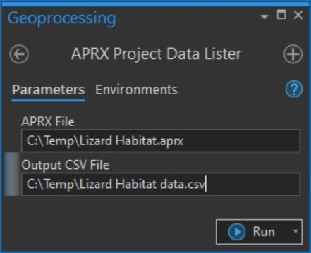
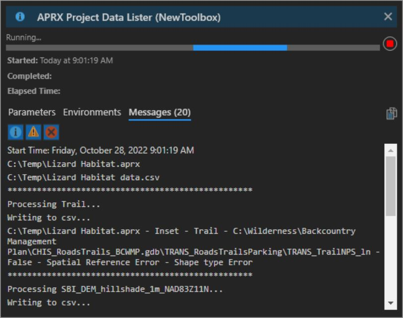
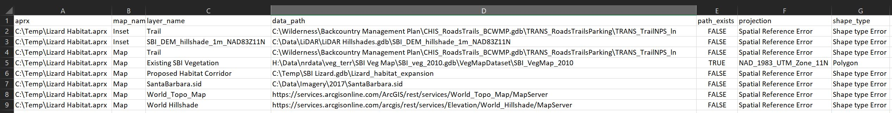

# chis-tools
Tools used at Channel Islands National Park that are universal enough to share on github for anyone that uses ArcGIS Pro software.

## Backup AGOL Services Tool

### Purpose
Package an ArcGIS Online or Portal feature service as a zipped file geodatabase with a time stamp and username in the filename. It can also export as a shp or geojson file. The file is temporarily staged on the user's AGOL contents but is removed once downloaded. 

### To Use
Enter one more Item ID's into the input parameters of the toolbox. The URL of your service in AGOL will look something like this  
https://nps.maps.arcgis.com/home/item.html?id=b115ada92f0c4b7cb91ee166a6165ca2

Use the item ID (b115ada92f0c4b7cb91ee166a6165ca2) of the feature service as input. Each service entered will have its own zip file generated in the output folder.  

You must be signed into AGOL (or Portal) through Pro to have access to the Item IDs entered into the tool. 

If you regularly enter the same item IDs and output folder, you can enter them as defaults.  To do that, right click on the tool in the Catalog Pane in Pro and go to the tool Properties. Under the Parameters section, enter item IDs separated by a semicolon with no spaces in between. Paste in the catalog path into the Output Folder default.  

Example default parameters: 

Example tool output messages: 

Example tool file output: 

## APRX Data Lister

### Purpose
Walk all maps in an ArcGIS Pro .aprx file and export to csv the layer names, layer data sources, projection, and other useful info about all layers in all maps. Useful for inspecting an aprx file with tons of data with a wide range of data sources. 

### To Use
Open tool in ArcGIS Pro. Drag and drop aprx from windows file explorer.  Output needs full path plus ".csv" extension  

Example screenshot of input parameters:  

Example screenshot of tool running with output messages: 

Example csv output. This allows for inspection of broken links or where layers point to data on disk: 

